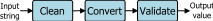

.. currentmodule:: cooked_input

Cooked Input Tutorial
*********************

.. note::

    Many users will to start with the `quick start <quick_start.html>`_ guide to get up and running with
    `cooked_input` quickly.

Introduction:
=============

Command line tools and terminal input are very useful. I end up writing lots of programs that get some simple input
from the user and process it. It may be a creating a report from a database or a simple text-based game. While it sounds
trivial, handling all of the exceptions and corner cases of command line input is not easy, and the Python standard
library doesn't have anything to make it easier. Let's start with a simple example.

The first program in an introduction to Python usually looks something like this::

    import random
    number = random.randint(1, 10)
    print('I am thinking of a number between 1 and 10.')
    guess_str = input('Guess what number I am thinking of: ')
    guess = int(guess_str)

    if guess < number:
        print('Buzz.... you guessed too low.')
    elif guess > number:
        print('Buzz.... you guessed too high.')
    else:
        print('Ding ding... you guessed it!')

Looks simple enough right? We get input from the user and convert it to an integer. But what happens when the user responds with 'a'::

    I am thinking of a number between 1 and 10.
    Guess what number I am thinking of: a
    Traceback (most recent call last):
      File "C:/apps/simple_input.py", line 67, in <module>
        simple_guess()
      File "C:/apps/simple_input.py", line 13, in simple_guess
        guess = int(input('Guess what number I am thinking of: '))
    ValueError: invalid literal for int() with base 10: 'a'

Let's look at what it takes to make the input robust. Checking that the input is: a number,
within the correct range, works with legacy Python (ie. version 2) and 3, etc. becomes::

        while True:
            if sys.version_info.major > 2:
                result = input('Guess what number I am thinking of: ')
            else:
                result = raw_input('Guess what number I am thinking of: ')

            try:
                guess = int(result)
                if guess < 1 or guess > 10:
                    print('not between 1 and 10, try again.')
                    continue
                break
            except ValueError:
                print('That is not an integer, try again.')

That's a lot of code to handle the simplest of inputs. This also forces a beginer to deal with advanced concepts such
as exceptions and versions of Python. This boiler plate code
is replicated and expanded for each input from the
command line. Just think of how much code you would need to get and validate a new password from a user --
making sure the input is hidden, is at least 8 characters long, has at least 2 upper case letters, has at least 2
punctuation marks, has at least 1 number, doesn't use the characters '[', ']', or '&', and
exits after 3 failed attempts.

The purpose of ``cooked_input`` is to make it easier to get command line input from the user. It
takes care of cleaning, converting, and validating the input. It also helps put together the prompt message and error
messages. In cooked_input, safely getting the value from the user in the guessing game becomes::

    prompt_str ='Guess what number I am thinking of'
    guess = get_int(prompt=prompt_str, minimum=0, maximum=10)

For a complete listing of the guessing game code using cooked_input, see simple_input.py in the examples directory.

In case your curious, the password example above can be written in cooked_input as::

    prompt_str = 'Enter a new password'
    good_password = PasswordValidator(min_len=8, min_upper=2, min_digits=1, min_puncts=2, disallowed='[]&')
    password = get_input(prompt=prompt_str, validators=[good_password], hidden=True, retries=3)

The CCV paradigm:
=================

``Cooked_input`` processes input using the Clean, Convert, Validate (CCV) paradigm. This is the underlying principal
used for getting input in ``cooked_input``.

    The "clean, convert, validate" (CCV) paradigm

In CCV, an input string is processed by first running it through a set of ``cleaners``. This is a set of zero or more
functions which clean the input string. For instance a cleaning function may convert a string from to upper case or
strip off white space from the ends of the string.

Next the cleaned string is run through a ``convertor`` function, which converts the string into the desired output
type. ``Cooked_input`` includes convertors for many types, such as integers, floating point numbers, Booleans, and dates.

Finally the cleaned, converted value is run through a set of ``validators``. This is a set of zero or more validation
functions which verify the value is acceptable. For instance, a validator may check that a value in a specified range.

If the value gets through the CCV pipeline without generating an error, the cleaned,
converted value is returned. Otherwise an error message is presented and the user is prompted to re-enter the value.

By combining ``cooked_input's`` rich set of cleaners, convertors and validators complicated inputs can be processed
easily. It is also easy to create your own custom cleaners, convertors and validators to expand ``cooked_input's``
functionality.

Using CCV in Convenience Functions:
===================================

In the `quick start <quick_start.html>`_ we saw how to use the ``cooked_input``
`convenience functions <get_input_convenience.html>`_ to process simple values. The convenience functions are
wrappers that set useful default values for the cleaners, convertor and validators. For instance, the
:func:`get_int` sets the convertor to :class:`IntConvertor` and has parameters for setting the minimum and
maximum values for validating the value is within a range :class:`RangeValidator`.

All of the convenience functions also take an optional set of cleaners and validators. For instance, a
:class:`NoneOfValidator` can be sent to ``get_int`` to get a value between -10 and 10, but not zero::

    not_zero_validator = NoneOfValidator([0])
    get_int(minimum=-10, maximum=10, validators=[not_zero_validator])

Breaking down get_input:
========================

The `convenience functions <get_input_convenience.html>`_ are wrappers around the `get_input` function. For instance,
``get_int`` is a wrapper around :func:`get_input` that automatically fills in some of the values required to get an integer
(e.g. set the convertor function to :class:`IntConvertor`).
Similarly, all of the other convenience functions (such as :func:`get_float`, :func:`get_boolean`, :func:`get_date`,
etc.) are just wrappers around get_input too.

The simplest call to `get_input` is:

.. code-block:: python

    result = get_input('What is your name')

This will prompt the user for their name and return a non-blank string. If the user types in a blank value (a zero
length string) they will receive an error message and be prompted to re-enter the value until a non-zero length string
is entered

.. note::

    By default get_input does not strip out white space, so typing a space or other whitespace characters would not be
    considered a blank string. This differs from ``get_string`` which defaults to stripping whitespace meaning a space
    would be cleaned to be a blank string

Let's look at a more complicated example. The get_int call in the guessing game makes a call to get_input that looks
something like this:

.. code-block:: python

    prompt_str = 'Guess what number I am thinking of'
    range_validator = RangeValidator(min_val=1, max_val=10)
    result = get_input(prompt=prompt_str, convertor=IntConvertor(),
        validators=range_validator, retries=3)

This call passes several parameters to ``get_input``:

 **prompt**: the string to print to prompt the user.

 **convertor**: the `Convertor` is called to convert the string entered into the type of value we want.
        `IntConvertor` converts the value to an integer (`int`).

 **validators**: the `Validator` function (or list of `Validator` functions) are used to check the entered
        string meets the criteria we want. If the input doesn't pass the validation, an error message is
        produced, and the user is prompted to re-enter a value.

        :class:`RangeValidator` takes a minimum and maximum value and checks that the input value is in the
        interval between the two. For example, `RangeValidator(min_val=1, max_val=10)` would make sure the value
        is between `1` and `10`. (i.e. `1<=value<=10`). In the case above, `max_val` is set to `None`, so no
        maximum value is applied (i.e. checks `1<=value`)

 **options**: there are a number of optional parameters that get_input can take (see `get_input` for more
        information). By default, get_input will keep asking for values until a valid value is entered. The
        `retries` option specifies the maximum number of times to ask. If no valid input is entered within
        the maximum number of tries a :class:`MaxRetriesError` exception is raised.

 **return value**: the cleaned, converted, validated value is returned. The returned value is safe to use as we
    know it meets all the criteria we requested. In this case, an integer value that is greater than or equal to `0`.

The general flow of `get_input` is:

    1) Prompt the user and get the input from the keyboard (sys.stdin)

    2) Apply the cleaner functions to the string.

    3) Apply the convertor function to the cleaned string.

    4) Apply the validator functionss to the converted value. The converted value needs to pass all of the
        validators (i.e. they are AND'd together). Other combinations of validators can be achieved by using
        the :class:`AnyOfValidator` (OR) and :class:`NoneOfValidator` (NOT) validators.

    5) Return the cleaned, converted, validated value.

.. note::

    The order of the cleaners and validators is maintained and applied from left-to-right. For example, if
    the list of cleaners is `cleaners=[StripCleaner(), CapitalizationCleaner(style='lower')]`, then the
    strip operation is performed before conversion to lower case. Applying these cleaners to the value `"  Yes "`
    is equivalent to the Python statement: `"  Yes ".strip().lower()` (strip, then convert to lower case), which
    would produce the cleaned value: `"yes"`.

.. note::

    The :func:`process_value` function runs all of the `get_input` processing steps on a value (i.e. runs
    steps 2--5 above.) This is useful for applying the same cooked_input cleaning, conversion and
    validation to values received from GUI forms, web forms or for data cleaning (from files or databases.) The
    `validate_tk` example shows how `process` can be used to validate an input in a GUI.

    Similarly, the :func:`validate` function can be used to just perform the validation step on a value. These two
    functions are very handy as they allow the same business logic (i.e. ``cooked_input`` code) to be used between
    input from the command line and other sources.

Custom Cleaners, Convertors and Validators:
===========================================

Writing custom cleaners, convertors and validators is easy in ``cooked_input``. To demonstrate, we will create a custom
convertor and validator for a simple class to represent an interval (i.e. a range of numbers):

.. code-block:: python

    class Interval(object):
        def __init__(self, min_val, max_val):
            # represent the interval as a complex number with the minimum
            # and maximum values as the real imaginary parts respectively
            self.interval = complex(min_val, max_val)

We can create a convertor function to convert a string with the format "x:y" (where x and y are integers) to an Interval.
Cooked_input convertor functions are inherited from the :class:`Convertor` baseclass and implement two methods.
The ``__init__`` method sets up any context variables for the convertor (none in this case) and calls super on the
Convertor baseclass. All cleaners, convertors and validators are callable objects in Python, meaning they define
the ``__call__`` method. The __call__ method is called to convert the value, and takes three parameters:

    * **value**: the value string to convert
    * **error_callback**: an error callback function used to report conversion problems
    * **convertor_fmt_str**: a format string used by the error callback function

.. note::

    The ``error_callback`` function and ``convertor_fmt string`` are used to set how errors are reported. For more
    information see: `error_callback <error_callbacks.html>`_

If an error occurs during the conversion, the ``__call__`` method should call the error callback function
(i.e. ``error_callback``) and raise a :class:`ConvertorError` exception. If the conversion is sucessful,
the __call__ methods returns the converted Value. The following code implements our Interval convertor:

.. code-block:: python

    class IntervalConvertor(Convertor):
        def __init__(self, value_error_str='a range of numbers("x:y")'):
            super(IntervalConvertor, self).__init__(value_error_str)

        def __call__(self, value, error_callback, convertor_fmt_str):
            # convert an interval formatted as "min : max"
            use_val = value.strip()
            dash_idx = use_val.find(':')

            if dash_idx == -1:  # ":" not found
                error_callback(convertor_fmt_str, value,
                    'an interval -- ":" not found to separate values')
                raise ConvertorError
            else:
                try:
                    min_val = int(value[:dash_idx])
                except (IndexError, TypeError, ValueError):
                    error_callback(convertor_fmt_str, value,
                        'an interval -- invalid minimum value')
                    raise ConvertorError

                try:
                    max_val = int(value[dash_idx + 1:])
                except (IndexError, TypeError, ValueError):
                    error_callback(convertor_fmt_str, value,
                        'an interval -- invalid maximum value')
                    raise ConvertorError

            if min_val > max_val:
                error_callback(convertor_fmt_str, value,
                    'an interval -- low value is higher than the high value')
                raise ConvertorError

            return Interval(min_val, max_val)

Validators have a similar structure to convertors. They are inherited from the :class:`Validator` base class and
implement the same two methods: ``__init__`` and ``__call__``. The ``__init__`` method has parameters defining
the attributes for valid values. The Interval validator is initialized with the minimum and maximum values (i.e.
an interval) and saves it as class member.

.. note::

    validators do not need to call to super on the Validator base class.

The ``__call__`` method verifies that the value is an Instance of the Interval class and that
it's minimum and maximum values are within the valid range specified in the ``__init__`` function. ``__call__`` takes
the same three parameters as convertors (``value``, ``error_callback``, ``validator_fmt_str``.) ``True`` is returned if
the value passes validation. If the value fails validation, ``error_callback`` is called to report the error
and ``False`` is returned. The Interval validator looks like:

.. code-block:: python

    class IntervalValidator(Validator):
        # validate an interval is within a specified range
        def __init__(self, range_interval):
            # range_interval specifies minimum and maximum input values
            self.range = range_interval

        def __call__(self, value, error_callback, validator_fmt_str):
            if not isinstance(value, Interval):
                error_callback(validator_fmt_str, value, 'Not an interval')
                return False

            if value.interval.real < self.range.interval.real:
                err_string = 'Low end below the minimum ({})'.format(
                    self.range.interval.real)
                error_callback(validator_fmt_str, value.interval.real,
                    err_string)
                return False

            if value.interval.imag > self.range.interval.imag:
                err_string = 'High end above the maximum ({})'.format(
                    self.range.interval.imag)
                error_callback(validator_fmt_str, value.interval.imag,
                    err_string)
                return False

            return True # passed validation!

The GetInput class:
===================

Peeling back the final layer the onion, the :func:`get_input` convenience function just creates an instance of
the :class:`GetInput` class and calls the ``get_input`` method on the instance. There are two times you might
may want to skip the ``get_input`` convenience function and create an instance of ``GetInput`` directly:

    #) If you are going to ask for the same input repeatedly, you can save the overhead of re-creating
        the instance by creating the ``GetInput`` instance once and calling its ``get_input`` and ``process_value``
        methods directly.
    #) To use the :func:`get_list` convenience function.

Creating an instance of teh GetInput class is easy; it takes the same parameters at the :func:`get_input` function:

    * **cleaners**: list of `cleaners <cleaners.html>`_ to apply to clean the value
    * **convertor**: the `convertor <convertors.html>`_ to apply to the cleaned value
    * **validators**: list of `validators <validators.html>`_ to apply to validate the cleaned and converted value
    * **\*\*options**: optional values. see the :class:`GetInput` documentation for details.

Using get_list:
===============

The :func:`get_list` convenience function is used to get a list of values from the user. The ``cleaners``,
``convertor``, and ``validators`` parameters are applied to the list returned. For example, using
:class:`LengthValidator` as the validator will check the length of the list, not the length of an element.
There are two additional parameters used by ``get_list``:

    * **delimiter**: the string (generally a single character) used to separate the elements of the list. By
        default a comma (',') is used as the delimiter.

    * **elem_get_input**: an instance of :class:`GetInput` to apply to each element of the list.

``Get_list`` cleans the input string, then calls :class:`ListConvertor` to split the input string by the delimiter
and runs the CCV process defined in the ``elem_get_input`` parameter on each each element of the list. Finally the
validator functions are run on the converted (list) value.

    The get_list pipeline

For example, to get a list of exactly three integers:

.. code-block:: python

    prompt_str = 'Enter a list of 3 integers'
    elem_gi = GetInput(convertor=IntConvertor())
    len_validator = LengthValidator(min_len=3, max_len=3)
    result = get_list(prompt=prompt_str, elem_get_input=elem_gi,
        validators=len_validator)

A second example is to get a list of at least two integers between `-5` and `5`

.. code-block:: python

    prompt_str = 'Enter a list of at least 2 integers (between -5 and 5)'
    elem_gi = GetInput(convertor=IntConvertor(),
        validators=[RangeValidator(min_val=-5, max_val=5)])
    length_validator = LengthValidator(min_len=2)
    result = get_list(prompt=prompt_str, elem_get_input=elem_gi,
        validators=length_validator)

.. note::

    The use of ``elem_get_input`` is a little strange to think about at first, but allows a lot of flexibility
    for getting list input. For instance, you can create a list where each element is a list itself by using
    :class:`ListConvertor` as the ``convertor`` to ``elem_get_input``.

    However, :func:`get_list` is currently limited to creating homogenous lists (i.e. each element must pass the same
    CCV chain) as `get_elem_input`` takes a single instance of ``GetInput``.

From Here:
==========

That completes the first part of the ``cooked_input`` tutorial. You can continue with
the `second part <tutorial2.html>`_ of the
tutorial. Or, for more information take a look at the `how-to/FAQ <how_to.html>`_
section of the documentation. You can also look at the various examples.